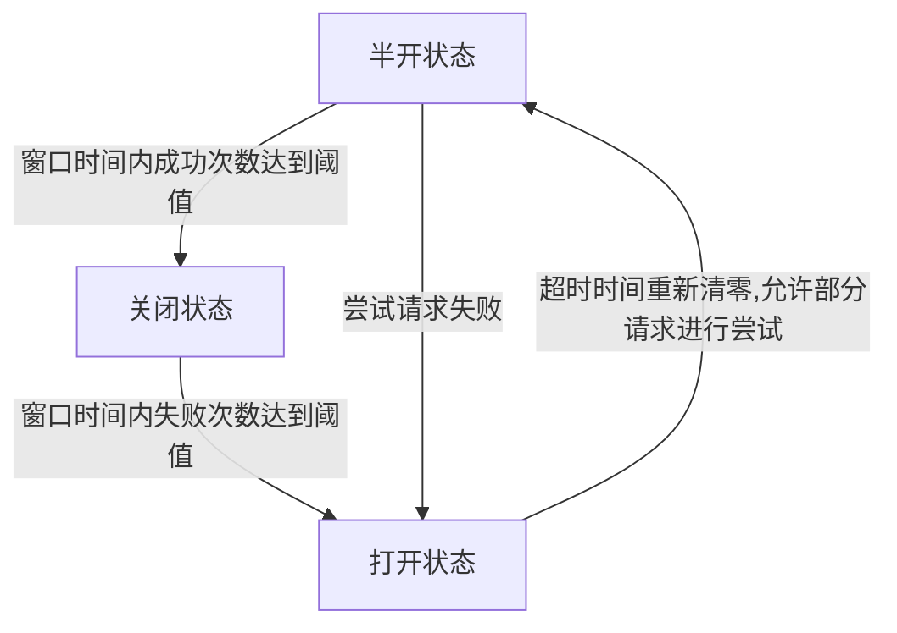

熔断器一种过载保护方式，是调用方自我保护的机制。
它通过包装对目标服务的调用，来持续监控故障率。一旦故障率达到某个阈值，熔断器将打开，并返回错误。

google SRE提供了一种自适应熔断算法来计算丢弃请求都概率，具体可以看[handling overload](https://sre.google/sre-book/handling-overload/#eq2101)

#### 工作原理




熔断器的三个状态：

- 关闭状态：默认状态，该状态熔断器关闭，请求可以顺利到达下级服务，该状态下需要统计时间窗口内的成功次数和失败次数，如果达到故障率阈值，则进入打开状态
- 打开状态：该状态下熔断器打开，请求直接返回错误，如果有回调则直接调用回调方法。熔断器会在超时时间后进入半开状态，进行部分请求都尝试
- 半开状态：在该状态下，会通过部分请求进行尝试，如果尝试成功，则重置熔断器并进入关闭状态，否则进入打开状态

#### 代码实现

可以参考[gobreaker](https://github.com/sony/gobreaker)实现

测试代码：

```go
import (
 "errors"
 "fmt"
 "net/http"
 "time"

 "github.com/gin-gonic/gin"
 "github.com/sony/gobreaker"
)

var startTime time.Time = time.Now()

func server() {
 e := gin.Default()
 e.GET("/ping", func(ctx *gin.Context) {
  if time.Since(startTime) < 5*time.Second {
   ctx.String(http.StatusInternalServerError, "pong")
   return
  }
  ctx.String(http.StatusOK, "pong")
 })

 fmt.Printf("Starting server at port 8888\n")
 e.Run(":8888")
}

func DoReq() error {
 resp, err := http.Get("http://localhost:8888/ping")
 if err != nil {
  return err
 }
 defer resp.Body.Close()
 if resp.StatusCode < 200 || resp.StatusCode >= 300 {
  return errors.New("bad response")
 }

 return nil
}

func main() {
 go server()

 // call with circuit breaker
 cb := gobreaker.NewCircuitBreaker(
  gobreaker.Settings{
   Name:        "my-circuit-breaker",
   MaxRequests: 3,
   Timeout:     3 * time.Second,
   Interval:    1 * time.Second,
   ReadyToTrip: func(counts gobreaker.Counts) bool {
    return counts.ConsecutiveFailures > 3
   },
   OnStateChange: func(name string, from gobreaker.State, to gobreaker.State) {
    fmt.Printf("CircuitBreaker '%s' changed from '%s' to '%s'\n", name, from, to)
   },
  },
 )
 fmt.Println("Call with circuit breaker")
 for i := 0; i < 100; i++ {
  _, err := cb.Execute(func() (interface{}, error) {
   err := DoReq()
   return nil, err
  })
  if err != nil {
   fmt.Println(err)
  }
  time.Sleep(100 * time.Millisecond)

 }
}

```
