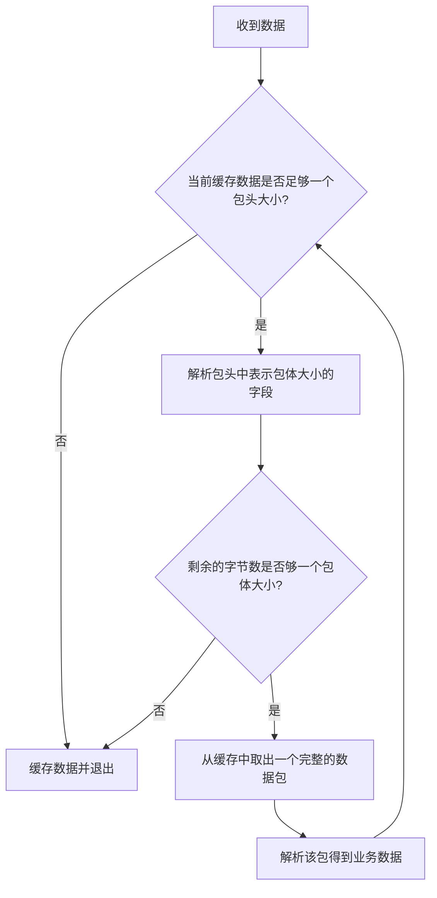

### 什么是粘包？

多个数据包(当然也可能包含接收到一半的数据包)在接收方缓存中连续存储，粘成一个包

### 粘包如何区分把包与包的边界区分出来？

#### 1. 固定包长的数据包

固定包长，即每个协议包的长度都是固定的，每次解析时取出固定长度的数据进行解析。
这种通信协议格式简单但是灵活性差。如果包的内容长度小于指定的字节数对剩余的空间就需要填充特殊的信息，如\0。
如果包的内容超过指定的字节数，就需要拆分成多个分片，需要增加额外的逻辑进行处理（如发送端分片逻辑及接收端组装分片逻辑）。

#### 2. 以指定的字符串为包的结束标志

这种协议比较常见，即在字节流中遇到特殊的符号值时就认为包结束。
这种协议一般用于一些包含各种命令控制的应用中，不足之处是如果协议数据包的内容需要使用包结束标志字符，就需要对这些字符做转码或者转义操作，
以免被接收方错误地当成包结束标志导致解析错误

#### 3. 包头+包体格式

这种格式包含包头和包体两部分，
包头是固定大小的，且包头必须包含一个字段描述接下来的包体大小。
当然，如果包头也可以包含整个包的大小的字段，这样包体可以通过其减去包头大小计算出来

### 解包处理



处理时需要注意点是：

1. 取包头时应该拷贝一份数据包头大小的数据出来，而不是从缓冲区中直接将数据取出来，因为若接下来根据包头中的字段得到包体大小时，剩余的数据不够一个包体的大小，则我们还得把这个包头数据放回缓冲区。为了避免这种操作，只有在缓冲区中的数据大小够整个包大小时，我们才会从缓冲区中取出整个包
2. 通过包头得到包体的大小时，需要对包体大小的数值进行校验，需要bodysize>0且bodysize <= 10 x 1024 x 1024(即10MB,可以根据实际确定最大值)。对于非法的bodysize，直接关闭连接
3.所有的处理逻辑放在一个while循环里

### TLV(type length value)

#### 协议演化

新修改协议导致旧的客户端无法兼容，这时我们升级服务端的协议格式，会导致旧的客户端无法使用，所以在最初设计协议时，需要增加一个版本号字段，针对不同版本做不同处理

对于字符串类型的字段，我们可以在该字段前面加一个表示字符串长度的标志，这种方法可以解决定义字符串类型时固定长度导致的问题

为了解决修改协议（新增字段或删除字段）需要兼容众多旧版本的问题，可以通过在每个字段前面加一个type类型来解决，这样，每个字段的类型就是自解释了，这就是TLV。

TLV类型虽然易于扩展，但是存在以下缺点：

- TLV格式因为每个字段都增加了一个type类型，所以占用的空间增大
- 在解析字段时需要额外增加一些判断type的逻辑，根据type类型做相应处理
- 每个字段的业务含义需要制定文档格式，TLV只是在技术上自解释

> 有的项目使用一种TTLV格式，即tag-type-length-value，增加一个tag解释

#### 协议可以分为二进制协议和文本协议

#### 可以通过IDL工具分析IDL文件，生成各种语言版本的协议代码，如google protobuf就是利用protoc作为IDL解析工具的

### 整型数值的压缩

### 设计通信协议注意事项

#### 字节对齐

`#pragma pack(push, n)`用于告诉编译器将接下来的所有结构体的每一个字段都按n字节对齐，不需要对齐功能后，应该使用`#pragma pack(pop)`让编译器恢复之前的对齐方式，
n=1表示按照一字节对齐，即去除所有padding字节

```c++
#pragma pack(push,1)
struct info
{
  short version;
  int32_t cmd;
  char gender;
  char name[8];
  int32_t age;
};

#pragma pack(pop)
```

#### 显示地指定整型字段的长度

应该使用int32_t，int64_t类型代替int,long型，因为不同机器字长的不同，导致协议解析出错或者产生错误的结果

#### 涉及浮点数时要考虑精度问题

为了避免不同的机器解析得到不同的结果，建议在网络传输时将浮点数值放大相应的倍数，变成整数或者转换为字符串来传输。

#### 大小端问题

在设计协议格式时，如果在协议中存在整型字段，则建议使用同一字节序，通常做法是在进行网络传输时将所有的整型都转换为网络字节序（大端编码），避免不同机器在解析时因为大小端问题而得到不同的整型值。

#### 协议自动升级功能

自动升级功能一般是将当前版本的版本号与服务端新版本的版本号进行比较，如果二者之间存在一个大版本号的差别，即有重大功能更新，则应该强制让客户端更新下载最新版本，如果是一个小版本号的更新，则可以让用户选择是否更新，当然如果是新版本修正了前一个版本中严重bug，也应当强制更新

### 包分片

包分片指导是应用层对包的拆分。当一个包的数据较大，超过一个包的最长长度时，需要对包进行分片。

#### 设计包分片方法

1. 设置分片标志。在包头部分设置一个字段来表示当前包是否属于某个大包的分片，分片标志字段一般有4种取值类型：无分片标志，包的第一个分片标志，包的最后一个分片标志，第一个分片和最后一个分片之间的包分片标志。
2. 在每个包分片的包头部分都有该包的总分片数量和当前分片编号。对于tcp来说，其数据传输本身是有序的，所以对于多个分片，只要一端按照顺序发送，另一端接收就一定是按发送顺序收到，不用考虑包分片的顺序问题。

### XML和JSON格式协议
